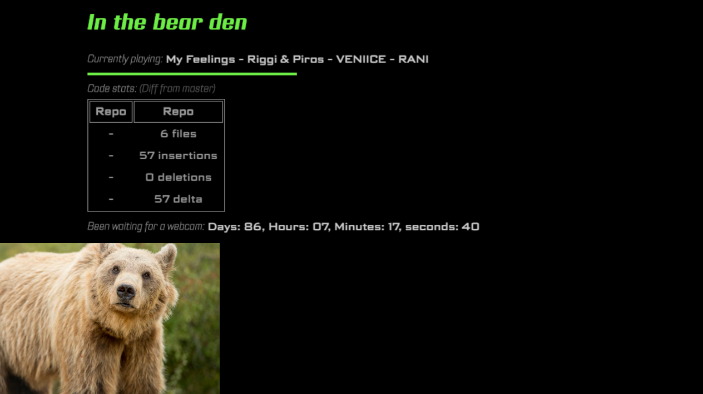

# In the den

## Introduction

This a small project that creates a simple webservice to show various stats from your current working environment.
The project is meant to be forked and extended for you own usage.
It is built on [flask](https://flask.palletsprojects.com/en/1.1.x/) and [javascript](https://developer.mozilla.org/en-US/docs/Web/JavaScript)

## Features

Included features are:

- Currently played spotify song.
- Git statistics showing your current diff from the master branch.
- Time since the author ordered a webcam. <!-- Still waiting, 2020-06-12T15:07:33.522Z -->
- A page showing a youtube video of pole dancing bears in a loop. <!-- Because why not? -->
- The option to extend and modify the service as you want. <!-- Be the lazy developer you are and hack it all the way! -->

## Example usages:

### As webcam

In combination with [OBS](https://obsproject.com/) and [OBS Virtualcam](https://obsproject.com/forum/resources/obs-virtualcam.949/)


## Installation

1. Fork or clone repository.
2. Install from `pyproject.toml`. I recommend using [poetry](https://python-poetry.org/)

```bash
poetry update
```

3. Run project

```bash
poetry run python server.py
```

## Configuration

To configure the current features add a config file `settings.cfg` in root folder of the repository.

Currently supported settings:

```conf
[SPOTIFY]
username=MY_USER_NAME
client_id=MY_SPOTIFY_CLIENT_ID
client_secret=MY_SPOTIFY_CLIENT_SECRET

[CODESTATS]
username=MY_GIT_USER_NAME
repos = ("/my/full/path/to/my/git/repo/one", "/my/full/path/to/my/git/repo/one")

[APP]
port=7007
```
